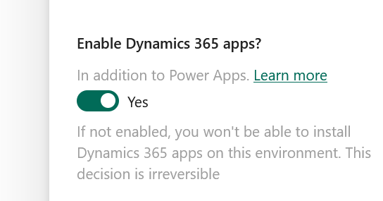

# Power Platform Deployment Pipeline Guide

This guide walks through setting up deployment pipelines in Microsoft Power Platform, including creating environments, installing required apps, and configuring deployment stages from Dev to Test to Prod.

---

## 🚧 Step 0: Create the Necessary Environments

You'll need to create **four** environments:
- **Dev**
- **Test** (must be a _Managed_ environment)
- **Prod** (must be a _Managed_ environment)
- **Orchestration/Host** environment

Environments are created and managed through the [Power Platform Admin Center](https://admin.powerplatform.microsoft.com/manage/environments).

> ⚠️ **Note:** Test and Prod environments **must be** _Managed_ environments for the pipeline to work correctly.

---

## 🧩 Step 1: Install the Power Platform Pipelines App

Go to the **Orchestration/Host Environment**:

- Navigate to **Resources** → **Dynamics 365 Apps**
- Click **Install App** → **Power Platform Pipelines**

  

> ❗ **If you do not see “Power Platform Pipelines” in the install options:**  
> Double-check the environment configuration. When creating the **Orchestration/Host Environment**, you must enable **Dynamics 365 Apps**.

---

## 🚀 Step 2: Access Deployment Pipeline Configuration

Go to [Power Apps Environments](https://make.powerapps.com/environments).

You should see the **Deployment Pipeline Configuration** listed there.

Click the **Play** button to access the pipeline dashboard:

---

## 🔧 Step 3: Configure the Pipeline

On the left-hand side, click on **Pipeline Setup**.  
From here, you can view:

- **Environments** (linked by ID)
- **Pipelines** (with defined stages)

> ⚠️ The environments listed here **must exactly match** the Environment IDs from the Power Platform Admin Center.

---

## 🔄 Step 4: Build the Deployment Pipeline

Once your environments are set up and registered in the pipeline configuration:

1. Start by **creating a Dev stage** and link it to your existing Dev environment by using its **Environment ID**.
2. Add a deployment stage from **Dev → Test**.

   

3. Then, create the next deployment stage: **Test → Prod**.
   - Make sure you **mark the previous deployment stage** before moving to the next.
   - Select **Prod_Env** as the target environment.

> ⚠️ **Reminder:** Only **Managed environments** can be used as target environments (i.e., Test and Prod).

---

## ✅ Final Notes

Now that your environments are configured and your pipeline stages are in place, you’re ready to begin using the Power Platform deployment pipeline to automate your solution delivery from Dev to Prod.

### Deploy an Agent

To deploy an agent, go to:  
[Copilot Studio - Environments](https://copilotstudio.microsoft.com/environments/<<Dev_Env>>/home)

1. Navigate to **Solutions**.

   

2. Find the correct solution or add your agent to a solution. Click the three dots (...) and select **Deploy**.

   

> ⚠️ **Note:** Depending on your setup, you might need to click **Check Solution** first before you can actually deploy.

Wait a few minutes, and you should now see your agent deployed on your **Test Environment**.

### Deploy Further Down the Pipeline

To deploy further down the pipeline, run the **Solution Checker** once more and deploy from **Test → Prod**.

If you have any deployment issues og bugs. [Refer to here](secondguide.md) or try your luck with AI :D 
---

## 📚 Good Resources

- [How to setup managed Environments](https://www.youtube.com/watch?v=XzW6XG-CdWU)
- [Pipeline Setup for Power Platform](https://www.youtube.com/watch?v=HAhObylsYgw&t=508s)
- [Adding Application Insights Telemetry](https://www.youtube.com/watch?v=ytdMLmQFXhc)
- [Overview of Setting Up Pipelines](https://learn.microsoft.com/en-us/power-platform/alm/set-up-pipelines)
- [Prerequisites for Personal Pipelines](https://learn.microsoft.com/en-us/power-platform/alm/platform-host-pipelines#prerequisites-for-personal-pipelines-using-the-platform-host)
- [Create a Pipeline in Power Apps](https://learn.microsoft.com/en-us/power-platform/alm/platform-host-pipelines#create-a-pipeline-in-power-apps)
